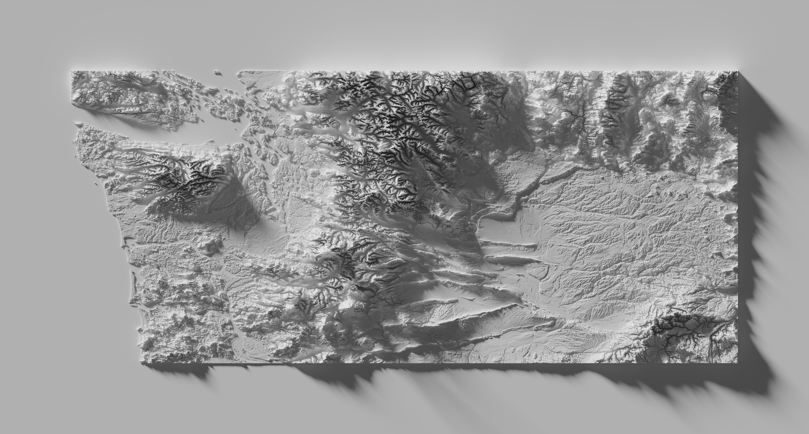

# Relief Map

Here are files I used to generate this map:

I followed [this tutorial](https://somethingaboutmaps.wordpress.com/blender-relief-tutorial-getting-set-up/) very closely.

Map data is from [OpenTopography](https://opentopography.org/) which provides wonderful API.

- `map.ipynb` provides code for obtaining and cleaning the data.
- `map.blend` is the blender file for rendering the image. You will have to modify this file (follow the directions in the tutorial to make it useable).
